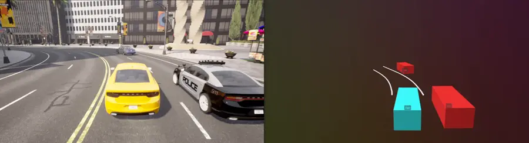
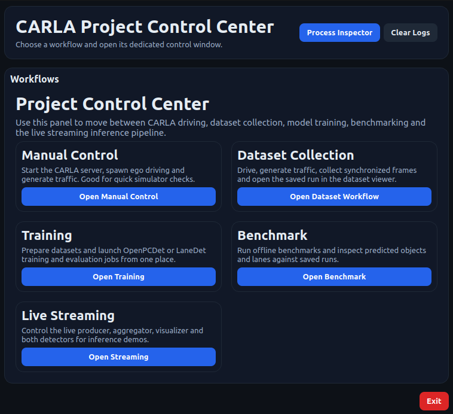

# CARLA Semantic Scene Reconstruction

CARLA workflow for synchronized dataset collection, detector training, offline benchmarking, and live scene reconstruction with GUI support.

<p align="center">
  
</p>

## Overview

* [Introduction](#introduction)
* [Documentation Map](#documentation-map)
* [Environments](#environments)
* [Project Structure](#project-structure)
* [GUI](#gui)
* [Reference Platform](#reference-platform)
* [Results](#results)
* [Third-Party Components](#third-party-components)
* [License](#license)

## Introduction

This repository combines four closely connected workflows:

* CARLA driving, traffic generation, and synchronized raw dataset collection
* Dataset preparation and model training for OpenPCDet and LaneDet
* Offline benchmarking with saved prediction outputs
* Live streaming inference with a lightweight control layer and Rerun visualization

### CARLA Runtime and Dataset Collection

Use CARLA 0.9.15 together with the `carla_app` environment to:

* Launch the simulator
* Drive the ego vehicle in synchronous mode
* Generate surrounding traffic
* Record synchronized RGB, LiDAR, object, lane, and state data
* Replay saved runs in Rerun

### Detector Training and Evaluation

The repository supports two detector stacks:

* `OpenPCDet` — 3D object detection on the project-specific `carla_nuscenes6` dataset family
* `LaneDet` — lane detection on a CARLA-derived dataset prepared in a TuSimple-compatible format

Both stacks are integrated as bundled submodules under `third_party/` and are wrapped by project commands for dataset preparation, training, and evaluation.

### Offline Benchmarking

The benchmark workflow measures per-frame model-forward time and end-to-end runtime on recorded CARLA runs. Saved benchmark predictions can be replayed later in Rerun for qualitative inspection.

### Live Streaming Inference

The live pipeline is split into cooperating processes:

* Producer that reads synchronized CARLA sensor data
* Detector nodes that attach to the shared frame stream
* Aggregator that merges predictions into one scene stream
* Rerun visualizer for live inspection

This keeps the CARLA-facing runtime lightweight while allowing OpenPCDet and LaneDet to stay in their own Conda environments.

## Documentation Map

Start with [Installation](docs/INSTALL.md), then follow the workflow-specific guides below:

* [CARLA](docs/CARLA.md) — simulator control, manual driving, traffic generation, dataset collection, and dataset replay
* [Streaming](docs/STREAM.md) — live producer, aggregator, visualizer, and detector nodes
* [Training](docs/TRAIN.md) — OpenPCDet and LaneDet dataset preparation, training, evaluation, and result layouts
* [Benchmarking](docs/BENCHMARK.md) — benchmark execution and saved prediction replay
* [GUI](docs/GUI.md) — Project Control Center, workflow windows, logs, and process state

## Environments

The project uses three Conda environments:

* `carla_app` — CARLA-facing tools, GUI, dataset utilities, Rerun viewers, and lightweight runtime tooling
* `openpcdet` — OpenPCDet dataset preparation, training, evaluation, benchmarking, and live inference
* `lanedet` — LaneDet dataset preparation, training, evaluation, benchmarking, and live inference

Environment setup and CARLA installation are documented in [Installation](docs/INSTALL.md).

## Project Structure

```text
carla-semantic-scene-reconstruction/
├── carla_server.sh   CARLA server launcher
├── config/           runtime configuration
├── docs/             workflow documentation
├── envs/             Conda environment definitions
├── gui/              Project Control Center
├── setup/            environment installer scripts
├── src/              shared project code
├── tools/            user-facing Python commands
└── third_party/      bundled third-party frameworks
```

## GUI

The repository includes a Project Control Center for interactive workflow control. It launches the same documented CLI commands used throughout the project, but groups them into dedicated workflow windows with process status, logs, and local state handling.

<p align="center">
  
</p>

Use the `carla_app` environment to launch it:

```bash
conda activate carla_app
python -m gui.main
```

See [GUI](docs/GUI.md) for details.

## Reference Platform

The project has been tested on:

* operating system: Ubuntu 22.04
* CPU: AMD Ryzen 5 3600X 6-Core Processor
* GPU: NVIDIA GeForce RTX 2080 Ti
* RAM: 32 GB

## Results

Raw CARLA runs used for the reported experiments are available in the:
[dataset-v1.0 release](https://github.com/Camill0x/carla-semantic-scene-reconstruction/releases/tag/dataset-v1.0)

Trained model checkpoints are available in the:
[models-v1.0 release](https://github.com/Camill0x/carla-semantic-scene-reconstruction/releases/tag/models-v1.0)

Dataset preparation, training and evaluation commands are documented in [Training](docs/TRAIN.md).

### OpenPCDet

OpenPCDet results use the project-specific `carla_nuscenes6` dataset family prepared from CARLA recordings.

| Model | mAP (%) | Car AP (%) | Truck AP (%) | Bus AP (%) | Motorcycle AP (%) | Bicycle AP (%) | Pedestrian AP (%) |
| --- | :---: | :---: | :---: | :---: | :---: | :---: | :---: |
| TransFusion-L | 67.79 | 87.46 | 74.95 | 87.13 | 76.75 | 44.32 | 36.14 |
| CenterPoint-PointPillar | 49.77 | 81.61 | 79.43 | 70.30 | 25.74 | 14.69 | 26.84 |

### LaneDet

LaneDet results use a CARLA-derived dataset prepared in a TuSimple-compatible format.

| Model | Accuracy (%) | FP (%) | FN (%) | Matched Lane MAE | Matched Lane RMSE | Point MAE | Point RMSE |
| --- | :---: | :---: | :---: | :---: | :---: | :---: | :---: |
| LaneATT-ResNet34 | 91.69 | 14.36 | 13.62 | 8.44 px | 9.39 px | 4.81 px | 16.81 px |
| RESA-ResNet34 | 93.55 | 7.75 | 11.15 | 5.47 px | 7.33 px | 3.47 px | 14.77 px |

### Benchmark Summary

| Framework | Model | Model FPS | Runtime FPS |
| --- | --- | :---: | :---: |
| OpenPCDet | TransFusion-L | 31 FPS | 23 FPS |
| OpenPCDet | CenterPoint-PointPillar | 48 FPS | 38 FPS |
| LaneDet | LaneATT-ResNet34 | 124 FPS | 48 FPS |
| LaneDet | RESA-ResNet34 | 43 FPS | 25 FPS |

### Visualization Latency

| Detector Setup | Scene Latency |
| --- | :---: |
| CenterPoint-PointPillar + LaneATT-ResNet34 | ~66 ms |
| CenterPoint-PointPillar + RESA-ResNet34 | ~102 ms |
| TransFusion-L + LaneATT-ResNet34 | ~106 ms |
| TransFusion-L + RESA-ResNet34 | ~136 ms |

## Third-Party Components

The project includes external frameworks under `third_party/`, including:

* `third_party/OpenPCDet`
* `third_party/lanedet`

Project-specific integrations, dataset adapters, configs, and wrappers are documented in [Training](docs/TRAIN.md).

## License

See the repository root and the bundled third-party components for licensing details.
